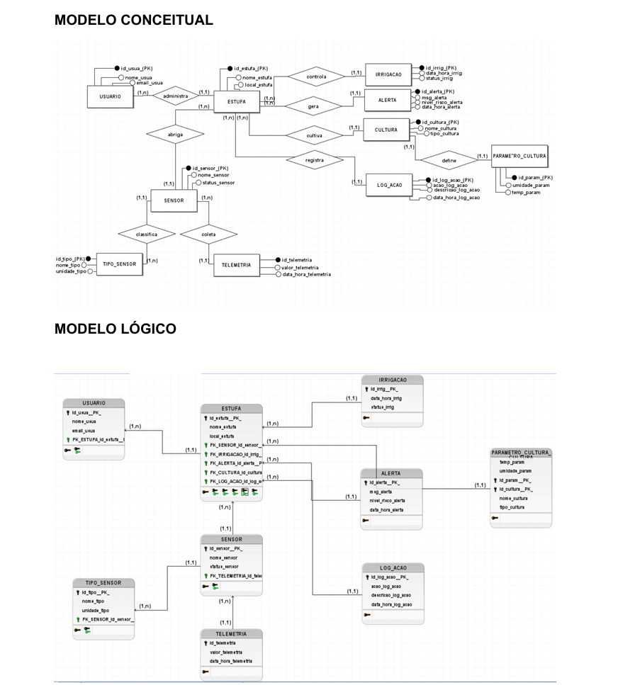

# Global solution | ARIS

## Integrantes do Grupo

| Nome | RM |
| --- | --- |
| Amandha Yumi Toyota Artulino | 563549 |
| Erick Takeshi Andrade Nakajune | 566059 |
| Giovanna Bardella Gomes | 561439 |

---

## Dominio do Projeto

O dominio escolhido para o projeto e a **Agricultura Inteligente Espacial**.

O ARIS representa uma plataforma de monitoramento e automacao de estufas inteligentes, com foco em coleta de telemetria, controle de irrigacao, cadastro de culturas e analise de alertas. As entidades foram organizadas em camadas seguindo os principios de arquitetura limpa e separacao de responsabilidades.

---

## Tecnologias Utilizadas

- .NET 9
- ASP.NET Core Web API
- Entity Framework Core
- Oracle Entity Framework Core Provider
- Oracle Database
- Swagger / OpenAPI
- JWT Authentication

---

## Estrutura da Solucao

A solucao esta organizada em camadas:

- **Aris.Domain**
  Contem as entidades e regras centrais do dominio.

- **Aris.Application**
  Contem DTOs, contratos, interfaces de servico e casos de uso.

- **Aris.Infrastructure**
  Contem:
  - DbContext
  - configuracoes de mapeamento com Fluent API
  - implementacoes de repository
  - migrations
  - servicos de integracao e seed

- **Aris.api**
  Projeto responsavel pela exposicao da API, configuracao de autenticacao, Swagger e DI.

- **Aris.Tests**
  Projeto de validacao de regras de dominio e DTOs.

---

## Diagramas



---

## Desenvolvimento

O desenvolvimento do ARIS foi dividido por responsabilidades para facilitar manutencao e evolucao:

- a camada `Domain` concentra as entidades e regras centrais
- a camada `Application` concentra contratos, DTOs e servicos
- a camada `Infrastructure` concentra persistencia, mapeamentos, migrations e repositories
- a camada `API` expõe os endpoints REST e configura autenticacao, Swagger e CORS
- a camada `Tests` valida regras de dominio e validacao de entrada

Durante a implementacao, foram aplicados:

- Entity Framework Core com Oracle
- Fluent API para mapear tabelas e relacionamentos
- repositories por contrato
- injeção de dependencia para desacoplamento
- JWT para autenticacao de endpoints protegidos
- tratamento de erros via middleware

---

## Entidades Modeladas

As principais entidades do sistema sao:

- Usuario
- Estufa
- TipoSensor
- Sensor
- Telemetria
- Cultura
- ParametroCultura
- Irrigacao
- Alerta
- LogAcao

---

## Relacionamentos do Sistema

Os relacionamentos foram modelados da seguinte forma:

- Usuario -> Estufa
  Um usuario pode possuir uma ou mais estufas.

- Estufa -> Sensor
  Uma estufa pode possuir varios sensores.

- Estufa -> Cultura
  Uma estufa pode cultivar uma ou mais culturas.

- Estufa -> Irrigacao
  Uma estufa pode registrar varios eventos de irrigacao.

- Estufa -> Alerta
  Uma estufa pode gerar varios alertas.

- TipoSensor -> Sensor
  Cada sensor pertence a um tipo de sensor.

- Sensor -> Telemetria
  Cada sensor gera varios registros de telemetria.

- Cultura -> ParametroCultura
  Cada cultura possui um conjunto de parametros agronomicos.

---

## Persistencia com EF Core

A persistencia foi implementada na camada `Aris.Infrastructure`, contendo:

- `ArisDbContext`
- configuracoes por entidade com `IEntityTypeConfiguration` e Fluent API
- aplicacao automatica das configuracoes com `ApplyConfigurationsFromAssembly`
- `DbSet` para as entidades do dominio
- migration inicial com o esquema do banco
- repositories concretos

### Principais configuracoes do DbContext

O `ArisDbContext` mapeia as tabelas e regras de relacionamento do sistema, incluindo:

- `Usuario` com indice unico em `Email`
- `Estufa` vinculada a `Usuario`
- `Sensor` vinculado a `Estufa` e `TipoSensor`
- `Telemetria` vinculada a `Sensor`
- `Cultura` vinculada a `Estufa`
- `ParametroCultura` vinculado a `Cultura`
- `Irrigacao` vinculada a `Estufa`
- `Alerta` vinculado a `Estufa`
- `LogAcao` para rastreamento de eventos

---

## Repositories

As interfaces dos repositories ficam na camada Application, e as implementacoes ficam na camada Infrastructure.

Exemplos:

- `IUsuarioRepository`
- `IEstufaRepository`
- `ITipoSensorRepository`
- `ISensorRepository`
- `ITelemetriaRepository`
- `ICulturaRepository`
- `IParametroCulturaRepository`
- `IIrrigacaoRepository`
- `IAlertaRepository`
- `ILogAcaoRepository`

---

## Injeção de Dependencia

O registro de dependencias foi configurado no projeto da API por meio do metodo:

```csharp
builder.Services.AddInfrastructure(builder.Configuration);
```

Esse metodo centraliza o registro do `DbContext`, repositories, servicos de aplicacao e servicos auxiliares no container de injeção de dependencia da aplicacao.

---

## Banco de Dados Utilizado

O SGBD utilizado neste projeto e:

**Oracle Database**

---

## Connection String

A connection string deve ser configurada no arquivo `appsettings.Development.json` do projeto da API.

Exemplo seguro:

```json
{
  "ConnectionStrings": {
    "ArisOracle": "Data Source=oracle.fiap.com.br:1521/orcl;User ID=<USUARIO>;Password=<SENHA>;"
  }
}
```

---

## Como Executar o Projeto

1. Restaurar os pacotes

```bash
dotnet restore Aris.sln
```

2. Compilar a solucao

```bash
dotnet build Aris.sln
```

3. Aplicar a migration no banco

```bash
dotnet ef database update --project Aris.Infrastructure --startup-project Aris.api
```

4. Executar a API

```bash
dotnet run --project Aris.api
```

5. Acessar o Swagger

```text
http://localhost:5070/swagger
```

### Instrucoes de acesso

- Abra a URL do Swagger no navegador apos iniciar a API.
- Para endpoints protegidos, primeiro faca login em `POST /api/auth/login`.
- Use o token JWT retornado no header `Authorization: Bearer <token>`.
- A connection string deve estar preenchida em `Aris.api/appsettings.Development.json` antes de executar a API.

---

## Migrations

A solucao contem migration versionada para criacao inicial do schema do banco.

Exemplo de comando para gerar migrations:

```bash
dotnet ef migrations add InitialCreate --project Aris.Infrastructure --startup-project Aris.api
```

Exemplo de comando para aplicar:

```bash
dotnet ef database update --project Aris.Infrastructure --startup-project Aris.api
```

---

## Testes

O projeto `Aris.Tests` valida:

- normalizacao de dados das entidades
- validacao de regras do dominio
- validacao de DTOs com `DataAnnotations`

Executar os testes:

```bash
dotnet test Aris.sln
```

### Exemplos de testes

Os testes automatizados cobrem cenarios como:

- criacao de `Usuario` com normalizacao de nome, e-mail e hash de senha
- validacao de `Estufa` com `UsuarioId` obrigatorio
- validacao de `Sensor` com identificadores validos
- validacao de `Cultura` com nome tratado e `EstufaId`
- validacao de `Alerta` com normalizacao do nivel de risco
- validacao de DTOs com campos obrigatorios e formatos invalidos

Exemplo de execucao esperada:

```text
PASS: Usuario normaliza dados
PASS: Estufa valida usuario
PASS: Sensor valida ids
PASS: Cultura valida dados
PASS: Alerta normaliza risco
```

---

## Evidencias

As evidencias complementares da entrega podem ser encontradas na pasta `/docs`, incluindo:

- diagrama do esquema fisico
- MER atualizado
- prints do banco apos aplicacao da migration
- justificativas de ajustes realizados
- prints do Swagger
- exemplos de request e response
- comprovacao dos testes executados

---

## Links da Entrega

- Video de demonstracao: https://youtu.be/v9bTbQkp-1w?si=4n0YqEnjGxkvWQKO
- Video Pitch: https://youtu.be/Ph5_hcT_nvc?si=Gfmp-l0GBqFMbAKS
- Link Repositório: https://github.com/ARIS-GlobalSolution/ARIS-.net.git

---

## Observacoes Finais

O projeto foi estruturado respeitando os principios de separacao por camadas, mantendo a persistencia concentrada na Infrastructure, os contratos na Application e a configuracao da API no projeto `Aris.api`.
